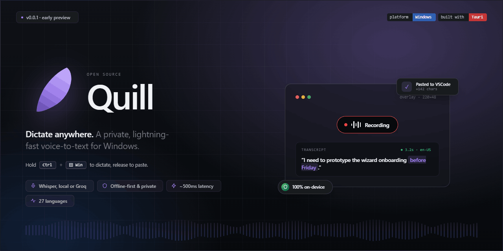

<p align="center"></p>

<p align="center">
  <a href="https://github.com/lautarosegura/quill/releases/latest"></a>
  
  
  <a href="https://github.com/lautarosegura/quill/issues"></a>
</p>

# Quill

Voice-to-text dictation for Windows and Linux. Hold a hotkey, speak, release — the transcript appears wherever your cursor is. Runs [whisper.cpp](https://github.com/ggerganov/whisper.cpp) locally (private, offline) or [Groq Cloud](https://groq.com/) (fast, ~$0.10 / month typical). Optional AI polish pass via Groq / Anthropic / OpenAI removes muletillas and normalizes punctuation. Built with [Tauri 2](https://tauri.app/) + [Svelte 5](https://svelte.dev/).

> **Status — v0.5.0, Windows + Linux.** Linux supports both X11 (full parity with Windows) and Wayland (hotkey via XDG portals + libei auto-paste, with an `input`-group fallback for compositors that lack portal support). macOS build is queued behind the whisper-cli Darwin binary + Accessibility permission flow.

### What's new in v0.5.0 — _AI polish pack_

Optional cleanup stage that runs after Whisper transcription. Pick a cloud LLM (**Groq, Anthropic, or OpenAI**), paste your API key, edit the system prompt, and every dictation gets piped through it before injection — muletillas removed, punctuation normalized, meaning untouched. Off by default. See **Settings → Pulido con IA**.

Earlier highlights: **v0.4.0** added Flatpak packaging + a wizard that detects your Wayland compositor and surfaces the right setup steps + native desktop notifications on Wayland. **v0.3.0** added Silero VAD pre-processing (no more trailing-silence hallucinations), exact-match vocabulary substitutions, and switchable prompt presets (General / Código / Email / Casual + custom). Full history in [CHANGELOG.md](CHANGELOG.md).

## Install

### Windows

1. Download **`Quill_<version>_x64-setup.exe`** from the [latest release](https://github.com/lautarosegura/quill/releases/latest).
2. Run the installer. Windows will show a **SmartScreen** warning because the binary is unsigned — click **More info → Run anyway**. (Signed releases are on the roadmap.)
3. On first launch, a 5-step wizard walks you through engine choice, model download, and a live dictation test.

### Linux

Pick the format that fits your distro:

- **`Quill_<version>_amd64.deb`** — Ubuntu, Debian, Mint, Pop!_OS. Install with `sudo dpkg -i Quill_*.deb`.
- **`Quill-<version>-1.x86_64.rpm`** — Fedora, RHEL, openSUSE. Install with `sudo rpm -i Quill_*.rpm`.
- **`Quill_<version>_amd64.AppImage`** — distro-agnostic. `chmod +x Quill_*.AppImage && ./Quill_*.AppImage`.

A **Flatpak manifest** (`flatpak/com.lauta.quill.yml`) is in the repo for local builds; Flathub submission is queued post-soak. Build instructions in [`flatpak/README.md`](flatpak/README.md).

Same first-launch wizard as on Windows. On Wayland the wizard now detects your compositor and only surfaces the `input`-group setup card on configs that need it (GNOME pre-48, Sway, Hyprland, KDE Plasma 5, wlroots).

#### Supported display servers

| Session | Status | Notes |
|---|---|---|
| X11 (any desktop environment) | ✅ Full parity | Same push-to-talk, paste, and focused-window tracking as Windows |
| Wayland / GNOME 48+ | ✅ Works | First hotkey bind prompts for approval via GNOME Settings; first auto-paste prompts for RemoteDesktop consent |
| Wayland / KDE Plasma 6+ | ✅ Works | KWin prompts on first bind / consent |
| Wayland / GNOME 46, 47 (Ubuntu 24.04 / 24.10) | ⚠️ Needs `input` group | GNOME pre-48 lacks the GlobalShortcuts portal — Quill falls back to reading raw kernel input events. Add yourself to the `input` group: `sudo usermod -aG input $USER` and log out + back in |
| Wayland / Hyprland | ⚠️ Needs `input` group OR `hyprland.conf` binding | Either use the evdev fallback (same `input` group setup), or configure the shortcut manually in `hyprland.conf` |
| Wayland / Sway, wlroots | ⚠️ Needs `input` group | Compositor doesn't implement the GlobalShortcuts portal yet — evdev fallback is the only path. Same `input` group setup |

Auto-paste on Wayland works via the XDG RemoteDesktop portal + libei. The first time you dictate on a Wayland session, the compositor asks permission to emulate keyboard input — approve once and the persistent restore-token (added in v0.2.2) skips the consent dialog on every subsequent launch. If the portal is unavailable or you deny the dialog, Quill falls back to clipboard-only mode and **also** fires a native desktop notification (added in v0.4.0) telling you to press **Ctrl+V**, so you don't miss the pill if your compositor placed it off-screen.

That's it. The app launches minimized to the tray; hit your hotkey in any window to dictate.

## Features

### Recording + transcription
- **Push-to-talk** with `Ctrl + Win` (Windows) or `Ctrl + Shift + Space` (Linux / macOS) as the default, configurable in Settings. Win-key events are intercepted at the OS level on Windows so the Start menu doesn't pop on release; on Linux Wayland the compositor owns the key binding via the GlobalShortcuts portal.
- **Hands-free lock mode** — tap-tap the hotkey quickly to start a recording that keeps going until you tap once more. Escape cancels.
- **Local or cloud engine** — Whisper on-device (private, offline, $0) or Groq Cloud (~500 ms latency). Switch per-session in Settings; no silent fallback between them.
- **Live VU meter** in Settings so you can verify your mic before dictating.
- **Overlay pill** at a configurable corner shows recording / transcribing / error states (Windows + Linux X11). On Wayland the pill still renders and a native desktop notification (added in v0.4.0) covers the cases where the compositor places the pill out of sight.

### Transcription quality
- **Silero VAD pre-processing** (v0.3.0) — eliminates the "you" / "thanks for watching" hallucinations Whisper produces from trailing-silence audio. On by default; toggle in Settings → Advanced.
- **Custom vocabulary** seeded into Whisper's decoder prompt so names, jargon, and acronyms transcribe correctly the first time.
- **Vocabulary substitutions** (v0.3.0) — exact-match post-transcription replacements with regex word boundaries, for the cases where Whisper still gets a brand name wrong despite the prompt.
- **Prompt presets** (v0.3.0) — switchable Whisper-decoder prompts (General / Código / Email / Casual + your own customs) so the model knows whether you're dictating a Slack message or a config file.
- **AI polish, opt-in** (v0.5.0) — optional final cleanup pass via **Groq**, **Anthropic**, or **OpenAI**. Removes muletillas (eh, mm, o sea), normalizes punctuation, doesn't change meaning. Off by default; configure in Settings → Pulido con IA.

### Productivity
- **Historial** — every transcription saved to local SQLite, with search, engine filter, and source-app tracking (shows which window you were in when you pressed the hotkey).
- **`Alt + Shift + Z`** to re-paste the last transcription without recording again.
- **Monthly Groq cost alert** — set a threshold, get a system notification when you cross it.

## Where your data lives

All state is stored under `~/.quill/` on your machine:

| File | Purpose |
| ---- | ------- |
| `config.json` | Settings (engine, hotkey, language, etc.) |
| `history.db` | Transcription history (SQLite) |
| `models/` | Downloaded Whisper models |
| `vocabulary.txt` | Custom vocabulary prompt |
| `failed/` | Preserved audio from failed transcriptions (swept after 24 h) |
| `logs/` | App logs |
| `alert_state.json` | Monthly cost-alert "last fired" tracker |

Your **API keys live in your OS's native credential store** (Windows Credential Manager on Windows; GNOME Keyring / KWallet via Secret Service on Linux), never in `config.json`. Each provider has its own slot — the transcription Groq key, and (when the polish feature is enabled) one slot per polish provider — so you can revoke any one independently. No telemetry, no analytics — the only data that leaves your computer is the audio you explicitly send to Groq (when Groq is the active transcription engine) and the transcribed text sent to your chosen polish provider (when AI polish is enabled).

## Keyboard shortcuts

| Shortcut | Action |
| -------- | ------ |
| `Ctrl + Win` (default) | Push-to-talk — hold to record, release to transcribe |
| tap-tap `Ctrl + Win` quickly | Start locked hands-free recording (tap once more to finish) |
| `Escape` while locked | Cancel the in-flight recording |
| `Alt + Shift + Z` | Re-paste the last successful transcription |
| `Ctrl + F` / `Ctrl + K` in Historial | Focus the search bar |

## Screenshots

<!-- Fill in with exported Claude Design screens or live captures. -->

_Coming soon — grab some screens after the first release._

## Development

### Prerequisites

- [Rust 1.77+](https://rustup.rs/)
- [Node.js 20+](https://nodejs.org/) and [pnpm 9+](https://pnpm.io/)
- [Tauri prerequisites](https://v2.tauri.app/start/prerequisites/) for your platform

### Setup

```bash
git clone https://github.com/lautarosegura/quill
cd quill
pnpm install

# Fetch the whisper-cli sidecar binary for your platform
./scripts/download-whisper-cli.sh        # macOS / Linux
.\scripts\download-whisper-cli.ps1       # Windows PowerShell
```

### Daily commands

| Command | Purpose |
| ------- | ------- |
| `pnpm tauri dev` | Dev mode with hot reload |
| `pnpm check` | Svelte + TypeScript type-check |
| `pnpm build` | Frontend production build |
| `cargo test --manifest-path src-tauri/Cargo.toml --lib` | Backend unit + integration tests |
| `cargo clippy --manifest-path src-tauri/Cargo.toml --lib -- -D warnings` | Backend lint |
| `pnpm tauri build` | Bundled installer (MSI + NSIS on Windows) |

Set `RUST_LOG=debug` before `pnpm tauri dev` to see verbose backend logs in the console.

### Project layout

```
quill/
├── src/                    ← Svelte frontend (main, overlay, wizard windows)
├── src-tauri/              ← Rust backend
│   ├── src/                  ← modules (config, orchestrator, hotkey, engines, …)
│   ├── binaries/             ← whisper-cli sidecar + DLLs (gitignored, populated by script)
│   ├── icons/                ← branded app + tray state icons
│   └── tools/                ← helpers (make_icons.ps1)
├── design/reference/       ← Claude Design bundle — source of truth for UI
├── docs/
│   ├── assets/               ← banner + screenshots
│   └── testing/              ← manual E2E checklist
└── scripts/                ← sidecar download + setup helpers
```

## Known limitations

- **macOS build pending** — waiting on the darwin whisper-cli binary + Accessibility permission flow
- **Unsigned installers** — SmartScreen warning on Windows; `.AppImage`, `.deb`, and `.rpm` are also unsigned
- **No focused-window tracking on Wayland** — Historial shows blank for the "dictated into" column (architectural limitation of Wayland, not fixable without compositor-specific hacks)
- **No auto-update** — upgrade by downloading the next installer (Flathub will solve this on Linux once the manifest is accepted)
- **Single-user** — designed for one person's machine
- **AI polish is cloud-only** — local LLM via llama.cpp sidecar is queued for v0.6+ (would mirror the whisper-cli sidecar pattern)
- **No streaming transcription** — push-to-talk model means the polish call adds 200-2000 ms after release; descoped from v0.5 by design

See [CHANGELOG.md](CHANGELOG.md) for the full feature history.

## Contributing

Bug reports and feature requests welcome via [GitHub Issues](https://github.com/lautarosegura/quill/issues) — there are templates to make it quick. For open-ended questions, use [Discussions](https://github.com/lautarosegura/quill/discussions).

## License

Dual-licensed under MIT OR Apache-2.0, at your option. See [LICENSE-MIT](LICENSE-MIT) and [LICENSE-APACHE](LICENSE-APACHE).

## Credits

Built on the shoulders of:

- [whisper.cpp](https://github.com/ggerganov/whisper.cpp) — local speech-to-text
- [Groq](https://groq.com/) — fast cloud transcription API
- [Tauri](https://tauri.app/) + [Svelte](https://svelte.dev/) — desktop app runtime and UI framework
- [Lucide](https://lucide.dev/) — icon glyphs
